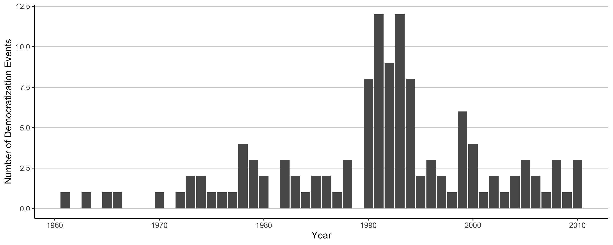
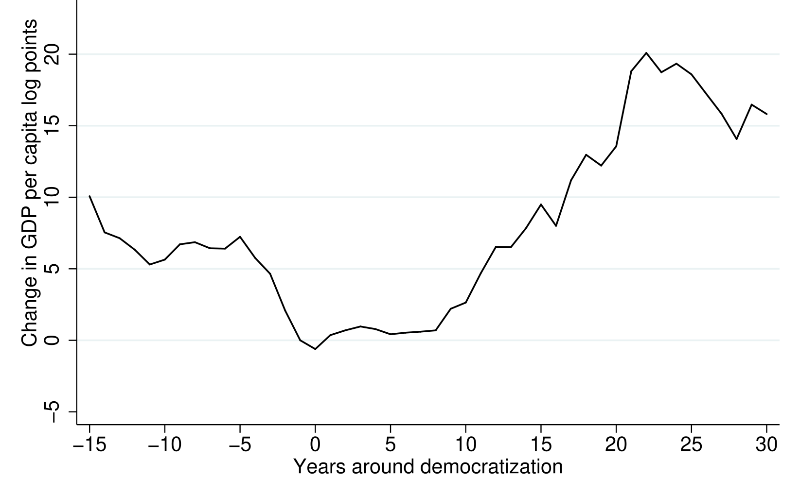

# DDCG Slides

[TOC]

Figures

- Figure DIP
- Figure DEM
- figure TREND

Tables

- Table 2 = DLPM
- Table 7 = Channels

---

## About the Paper

**Does Democracy cause Growth?**

Authors

-   [Daron Acemoglu](https://economics.mit.edu/sites/default/files/styles/facutly_profile_feature_image/public/2022-12/daron-acemoglu30.jpg?h=620fd1cb&itok=2p17a0hs) (MIT)

-   [James A. Robinson](https://harris.uchicago.edu/files/styles/square/public/2022-01/james-robinson-headshot-2022.jpeg?itok=NVPPH7Na) (U. of Chicago)

-   [Suresh Naidu](https://www.sipa.columbia.edu/sites/default/files/styles/1_1_1536x1536/public/2023-10/Suresh%20Naidu%20Headshot.png.jpeg?itok=atidRtoO) (Columbia)

-   [Pascual Restrepo](https://external-content.duckduckgo.com/iu/?u=https%3A%2F%2Fifs.org.uk%2Finequality%2Fwp-content%2Fuploads%2F2022%2F03%2FPascual-Restrepo-1.jpg&f=1&nofb=1&ipt=f7bbe9b625908183da52bcb9c3d1cb8ab1a2d2d4f47670feb0a38645567d3d99&ipo=images) (Boston U.)

[Cover of JPE](https://economics.sas.upenn.edu/sites/default/files/2020-02/jpe%20jan2020.jpg)

::: notes

- research by 4 economists from top-university
- very prominent paper, widely recognized
- impact on literature / research
    - as most papers by acemoglu

:::

---
## Literature on Growth and Democracy

| Authors                                         | Relationship                                      |
| ----------------------------------------------- | ------------------------------------------------- |
| [@lipsetSocialRequisitesDemocracy1959a]         | $\text{growth} \to \text{democracy}$              |
| [@barroDemocracyGrowth1996]                     | $\text{democracy} \to \ \downarrow \text{growth}$ |
| [@giavazziEconomicPoliticalLiberalizations2005] | $\text{democracy} \rightsquigarrow \text{growth}$ |
| [@acemogluDemocracyDoesCause2019]               | $\text{democracy} \implies \text{growth}$         |

Meta Analysis: [@colagrossiDoesDemocracyCause2020]

::: notes

- vast research (basic econometric question (What causes growth?)
- dates back to Lipset Hypothesis (1959): 
    - growth => democracy
- 90s: first econometric tests : 
    - simple OLS Regressions (Robert Barro) => negative effect
- 2000s: more advanced statistical methods 
    - => inconclusive, nto always significnat
- Acemoglu et al 2019: conclusive evidence:
    -  Democracy => growth

:::

---

## Data

Democracy Measure

- constructed from different sources
- dichotomous 
- 1960 - 2010, 184 Countries

Growth Data = World Bank

::: notes

*Democracy Measure*

- constructed from 4 different data sources (Freedom House, Polity IV, 2 papers)
- dichotomous / binary: either 0 (not democracy) or 1 (democracy)
- 1960-2010 (50 years), 184 countries

*Growth Data* (gdp per capita, 2000 Dollars) & other economic variables  = World Bank

Figure: 122 democratizations in this time frame, most around 1990s (post soviet transformations)

:::

---

## Problem: GDP Diversity and Dip

- heterogeneity of GDP growth
- Dip of GDP preceding democratization

$\to$ OLS not applicable

::: notes

2 problems in the research

- GDP growth = **very** heterogenous
- before a democratization = decline in growth
    - often reason for protests etc

[Figure]

standard OLS not applicable

- omitted variable bias

:::

---

## Method

3 Approaches

1. **Dynamic Linear Panel Model** with *Within Estimator*
2. Semiparametric Estimation
3. Instrument Variable Regression (see **XX**)

Panel Formula

$$
y_{ct} = \beta D_t + \sum_{j=1}^p \gamma_j y_{ct-j} + \alpha_c + \delta_t + \epsilon_{ct}
$$

::: notes

*Different Approaches*

1. ***Dynamic Linear Panel Model** with Within Estimator*
2. *Semiparametric Estimation* (relax assumption of linear relationship)
3. *Instrument Variable Regression* (regional waves of democratization)

Explanation

MOdel focuses on "switchers" (countries that democratise)

- **Dynamic**: Lags of variables (to account for the Dip)
- **linear**: Linear relationship assumption (democracy and growth)
- **Panel**: cross country comparison
- **Within Estimator**: Estimator for Fixed Effects Models
    - country fixed effecrs
    - year fixed effects

Formula (looks like a beast, but lets explain)

-   $y_ct$ = log GDP per capita in country *c* at time *t*

-   $D_{ct}$ = Dichotomous measure of democracy

-   *p* lags of log GDP for control

-   $\alpha$ = country fixed effects

-   d = time fixed effects

-   $e$ = error term

lets look at results ->

:::

---

## Results Table

[TABLE 2]

::: notes

:::

---

## Results Figure

::: notes

- black = trend estimate
- dashed = 95 % confidence intervals

after 25 years = **16,895** % higher GDP

=> effect levelling off = "one off"

:::

---

## Interlude: Replication in R

- Model Specification
- Results Table 
- Trend Estimate

---

## Channels

[TABLE 7]

Democratization => Economic reforms, school enrolment, more taxes

= **state capacity & human capital building**

See **XX** to website

---

## Critique

- Dichotomous Measure of Democracy [@pelkeReanalysingLinkDemocracy2023]
- Short Time Frame 
- Sensitivity to Sample Selection [@eberhardtDemocracyDoesCause2019]

::: notes

*Dichotomous Measure of Democracy*

- not binary, scale (democracy, illiberate democracy, authoritarian rule, dictatorship)
- newer analysis does it (Lars Pelke: Varieties of Democracy)

*Short Time Frame*

- only 50 years
- only 1 of the 3 waves of democratization 

*Sensitivity to Sample Selection*

- depends heavily on the eastern communist states (+ short time)
- Markus Eberhardt Comment: 
    - random drop of observations (ca 5%)
    - => effect only half

:::

---

## References

---

## Discussion Questions

1. Are there <u>alternative political frameworks</u> that could also facilitate these mechanisms (state capacity and education expansion) or is it easier in democracies?
2. Could there be <u>non-linear relationships</u> between democracy and economic growth, e.g optimal level of democracy? 
3. What actionable <u>policy recommendations</u> can be drawn from the observed link between democracy and economic growth?

::: notes

*Are there **alternative political frameworks** that could also facilitate these mechanisms (state capacity and education expansion) or is it easier in democracies?* 

- elephant in the room = China (achieved both)
- communist states in general = high state capacity

*Could there be **non-linear relationships** between democracy and economic growth, e.g optimal level of democracy?* 

- a level of democracy beyond which growth is hurt?
- for example monetary policy = undemocratic in most democracy today

*What are the **Policy Implications** drawn from the link*

:::

---

## Appendix: IV Model Specification

$$
y_{ct} = \beta D_{ct} + \sum_{j=1}^p \gamma_j y_{ct-j} + \alpha_c + \delta_t + \epsilon_{ct}
$$

with D as IV:

$$
D_{ct} = \sum_{j=1}^p \pi_j Z_{ct-j}+ \sum_{j=1}^p \phi y_{ct-j} + \Phi_c+ \mu_t+ v_{ct}
$$

Code: **XX** to Website

---

## Appendix: IV Model Results

[TABLE 6]

---

